# SecureMail Scanner 📧🛡️

Real-time email filtering and analysis system, designed to intercept, analyze, and block threats based on YARA and Sigma rules.

---

## 🚀 What is SecureMail Scanner?

SecureMail Scanner is a containerized email security platform built on:

* **Postfix** as the SMTP server
* **Python Scanner** using **YARA** for malware analysis
* **Grafana + Loki + Promtail** for visualization and alerts
* **Docker Compose** for modular and scalable deployment

---

## 🛠️ Technology Stack

| Component         | Technology      |
| :---------------- | :-------------- |
| SMTP Server       | Postfix         |
| Malware Scanner   | Python + YARA   |
| Event Correlation | Sigma           |
| Log Visualization | Grafana         |
| Log Aggregation   | Loki + Promtail |
| Containerization  | Docker Compose  |

---

# 🏛️ Email Scanning System Architecture

This project implements a modular architecture for receiving, analyzing, and visualizing emails for threat detection.

## General Diagram

```mermaid
flowchart TD
    A["🌐 Internet / External Senders"] --> B["📮 Postfix SMTP Server (Docker)"]
    B --> C["🔎 Content Filter -> Python Scanner"]
    C -->|"✅ Clean Email"| D["📥 Local Delivery"]
    C -->|"🚫 Malware Detected"| E["🚨 Quarantine + Alert System"]
    E --> F["📊 Grafana Dashboard"]
```

---

## 📦 Quick Deployment

1. Clone the repository:

bash
git clone git@github.com:CarlosNadal/holbertonshcool-cybersecurity-final-proyect.git
cd holbertonshcool-cybersecurity-final-proyect

2. Build and launch the containers:

bash
docker-compose up --build -d

3. Access the Dashboard:

- Grafana: http://localhost:3000  
- Username: admin  
- Password: admin

---

## 🔥 Key Features

* Real-time email scanning
* Customizable YARA-based detection engine
* Automatic quarantine of suspicious emails
* Incident alerts via Grafana and Promtail
* Resilience: Auto-restart of critical services
* Production-ready with private Docker network

---

# 👨‍💻 Contributions

Pull Requests are welcome!
Please follow the branch structure:

- feature/* for new features  
- bugfix/* for fixes  
- docs/* for documentation

---
